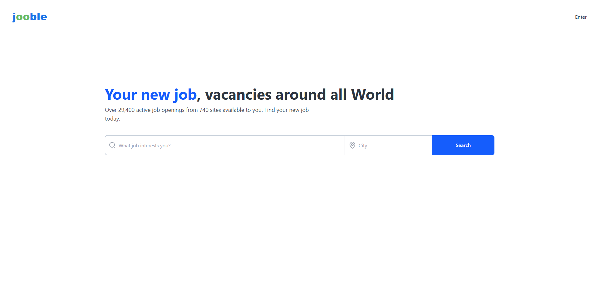
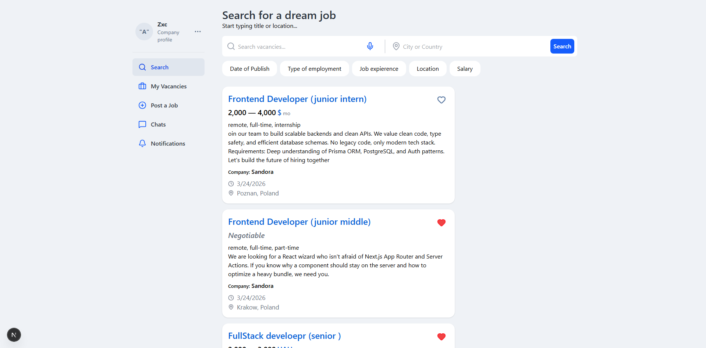
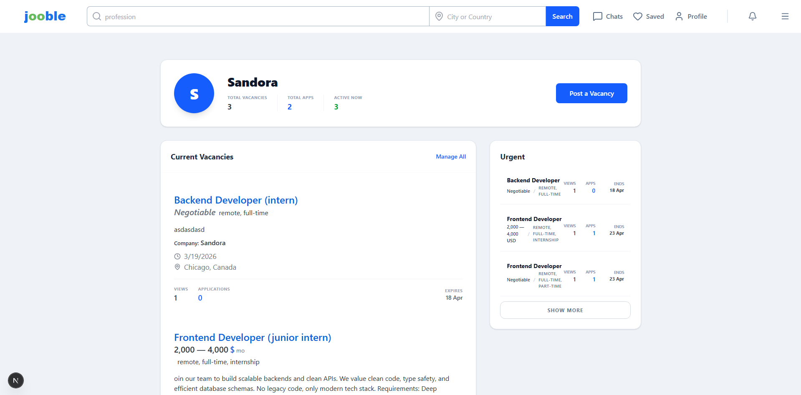
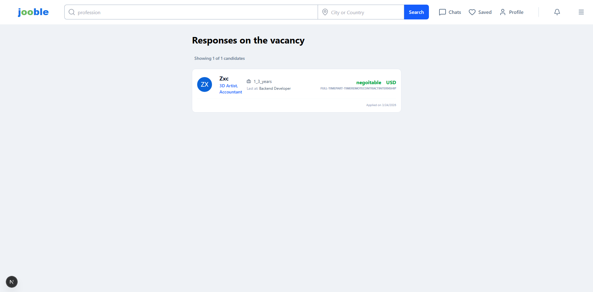
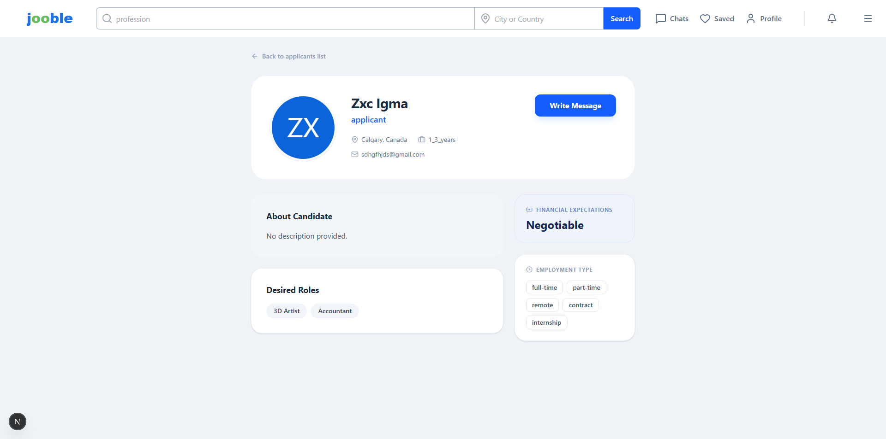
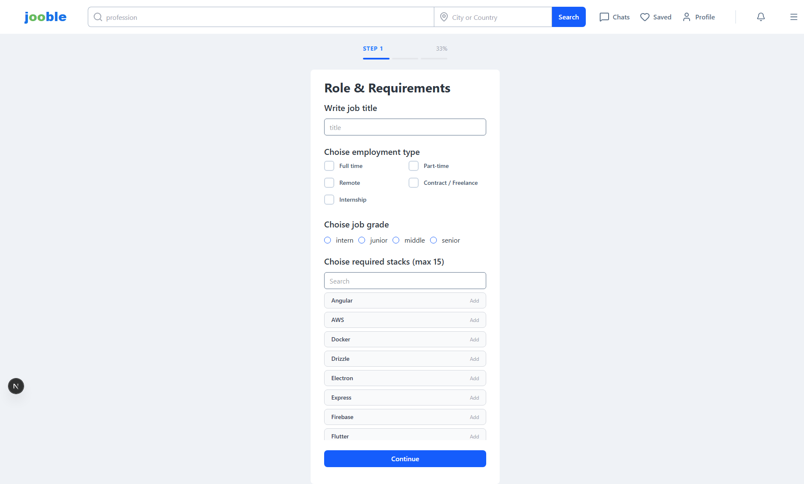
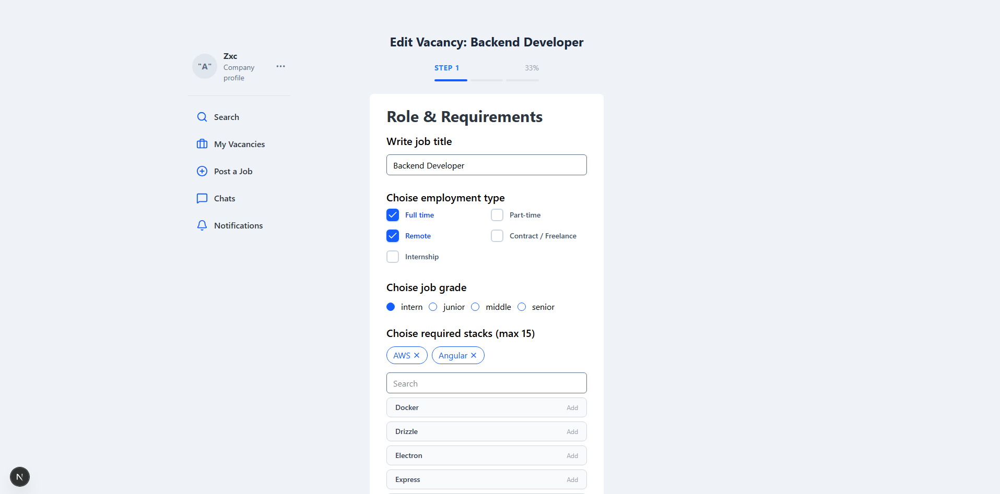
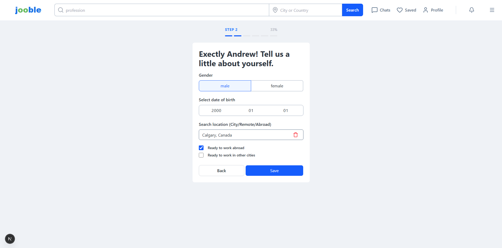
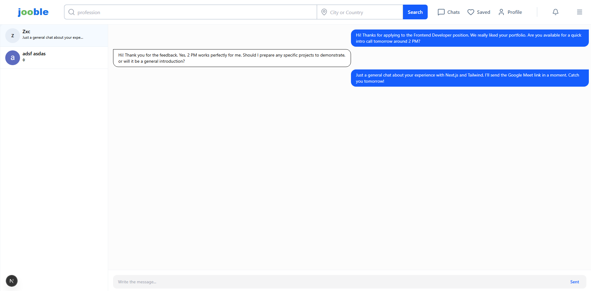
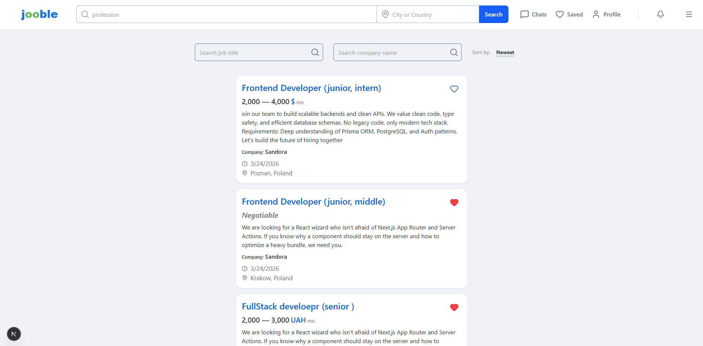

# Vacancy Search Platform

A full-stack web app for finding jobs, managing vacancies, and communication between applicants and employers.

[🚀 Live Demo](job-finder-app-ten.vercel.app) | [💻 Source Code](https://github.com/sedno-nstd/job-finder-app)

---

## 📌 Overview

A high-performance MVP for a job-matching platform. Developed to demonstrate advanced full-stack patterns: type-safe data fetching with Server Actions, 
complex relational database schemas, and modular UI architecture.

- Applicants can search, save, and apply for jobs, and manage their profiles  
- Employers can create and manage vacancies, and review candidates  
- Built-in chat allows direct communication between both sides  

---

## 📸 Interface Preview

### 🌐 Public & Discovery
| Main Landing | Job Listings |
| :---: | :---: |
|  |  |

---

### 🏢 Employer Dashboard
| Employer Profile | Applicants Dashboard |
| :---: | :---: |
|  |  |

| Vacancy Applications | Candidate Profile |
| :---: | :---: |
|  |  |

---

### 🛠 Vacancy Management
| Create Vacancy | Edit Vacancy |
| :---: | :---: |
|  |  |

---

### 💬 Communication & Flow
| Onboarding | Chat | My Applications |
| :---: | :---: | :---: |
|  |  |  |

---

## ✨ Main Features

### 🔐 Auth & Roles
- Two roles: Applicant and Employer  
- Separate onboarding flows  
- Authentication via NextAuth (Credentials + Google)  
- Middleware-protected routes  

### 👨‍💻 Applicant Features
- Vacancy search with filters (date, type, salary, location)  
- Save / unsave vacancies  
- Apply to jobs and track status  
- Editable profile (skills, experience, contacts)  
- Chat with employers  

### 🏢 Employer Features
- Create / edit / delete vacancies  
- View applicants per vacancy  
- Access applicant profiles  
- Start conversations with candidates  

---

## 🛠 Tech Stack

- **Framework:** Next.js 16 (App Router)  
- **Frontend:** React 19, TypeScript, TailwindCSS  
- **Backend:** Next.js Server Actions  
- **Database:** PostgreSQL + Prisma  
- **Auth:** NextAuth.js  
- **State & Forms:** Zustand, React Hook Form + Zod  

---

## 🗄 Database Highlights

- Relational structure: Users, Vacancies, Applications, Messages  
- Favorites system via Many-to-Many relations  
- Cascade deletes for related data (applications, chats)  
- Optimized queries using Prisma `select` / `include`  

---

## 🎯 Focus Areas

- Server-side mutations with Server Actions  
- Handling relational data and async flows  
- Separation of client and server logic  
- Reusable component architecture  

---

## 🚧 Limitations

- Chat is request-based (no WebSockets yet)  
- Basic recommendation system  
- Some UI parts can be improved  

---

## 🚀 Getting Started

```bash
git clone https://github.com/sedno-nstd/job-finder-app
cd job-finder-app

npm install

cp .env.example .env

npx prisma migrate dev

npm run dev
